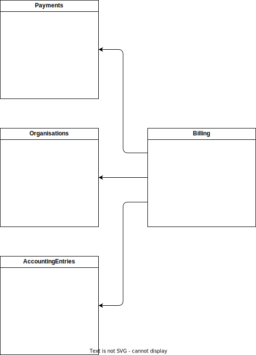

## David Cloutier Work Log



* 2019-07-06 : Initial clone and exploration.
    * Concerns: 
        * I have a basic knowledge of kotlin so I'll need to brush up on that.
    * Notes:
        * I need to get to know the existing classes to understand how they all work together
        * Ran the junit tests make sure they already pass.
        * Ran the docker start to make sure my environement is properly configured to run the app
        * Added a basic implememntation of the Billing Servce and some basic tests.
        
* 2019-07-10 2h : 
    * Added test for insuficient funds and payment provider network issues

* 2019-07-16 4h:
    * Added filtering of invoices by date.
    * integrted it with the rest service.
    * added reporting to see how the billing cycle went.
    * added cases my billing provier
    
* 2019-07-22 2h :
    * after a small break for vacation, i need to submit this as im leaving for another week of camping and paraglidding.
    * cleanup and merge. 
    
* GLOBAL TODO:
    * [X] Setup my environment
    * [X] Run tests
    * [X] Run docker image
    * [X] Add missing invoice statuses
    * [X] Add logging.
    * [X] Add billing Service basic impl and simple test.
    * [X] Add data in mocked database to create invalid states (invalid currencies) 1 in 20 are botched invoices. NOTE: I just realized that customers could probably request to be boilled in another currency than their default, so this actually could be a valid state... oh well, this "fake" invalid state helps me test my error handling.
    * [X] Add Junit tests to verify handling of errors
    * [-] Make sure invoice update in databse and billing provider use the same transaction. NOTE This will be added as a future feature as the implementation of the paymemnt provider is too black-box...
    * [X] Create a simple rest endpoint to handle an invoice
    * [X] Add filtering fetch by next schedulled Billing Date on the invoice.
    
* END NOTES:
    * There arent enough Junit to attain the coverage that I find acceptable... but since I'm leaving on vacation, I'll let it go and submit this for partial review ;)
    * Kotlin was really fun to explore, there are so many possibilities to improve on this code if I mastered the language a bit more.
    * The whole date aspect of the challenge was a bit put on the side as I assumed that the billing dates and time were stored in UTC. 
    * If multiple instance of this were to run simultanouslly, we would need to figure out how to "lock" the records by instance.ß

## Antaeus

Antaeus (/ænˈtiːəs/), in Greek mythology, a giant of Libya, the son of the sea god Poseidon and the Earth goddess Gaia. He compelled all strangers who were passing through the country to wrestle with him. Whenever Antaeus touched the Earth (his mother), his strength was renewed, so that even if thrown to the ground, he was invincible. Heracles, in combat with him, discovered the source of his strength and, lifting him up from Earth, crushed him to death.

Welcome to our challenge.

## The challenge

As most "Software as a Service" (SaaS) companies, Pleo needs to charge a subscription fee every month. Our database contains a few invoices for the different markets in which we operate. Your task is to build the logic that will pay those invoices on the first of the month. While this may seem simple, there is space for some decisions to be taken and you will be expected to justify them.

### Structure
The code given is structured as follows. Feel free however to modify the structure to fit your needs.
```
├── pleo-antaeus-app
|
|       Packages containing the main() application. 
|       This is where all the dependencies are instantiated.
|
├── pleo-antaeus-core
|
|       This is where you will introduce most of your new code.
|       Pay attention to the PaymentProvider and BillingService class.
|
├── pleo-antaeus-data
|
|       Module interfacing with the database. Contains the models, mappings and access layer.
|
├── pleo-antaeus-models
|
|       Definition of models used throughout the application.
|
├── pleo-antaeus-rest
|
|        Entry point for REST API. This is where the routes are defined.
└──
```

## Instructions
Fork this repo with your solution. We want to see your progression through commits (don’t commit the entire solution in 1 step) and don't forget to create a README.md to explain your thought process.

Please let us know how long the challenge takes you. We're not looking for how speedy or lengthy you are. It's just really to give us a clearer idea of what you've produced in the time you decided to take. Feel free to go as big or as small as you want.

Happy hacking 😁!

## How to run
```
./docker-start.sh
```

## Libraries currently in use
* [Exposed](https://github.com/JetBrains/Exposed) - DSL for type-safe SQL
* [Javalin](https://javalin.io/) - Simple web framework (for REST)
* [kotlin-logging](https://github.com/MicroUtils/kotlin-logging) - Simple logging framework for Kotlin
* [JUnit 5](https://junit.org/junit5/) - Testing framework
* [Mockk](https://mockk.io/) - Mocking library
